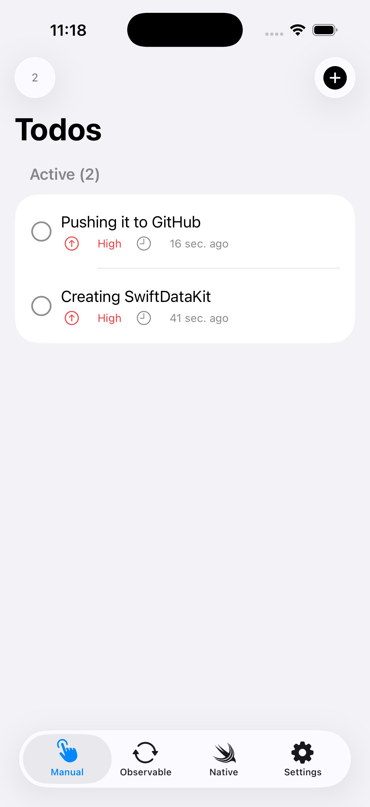
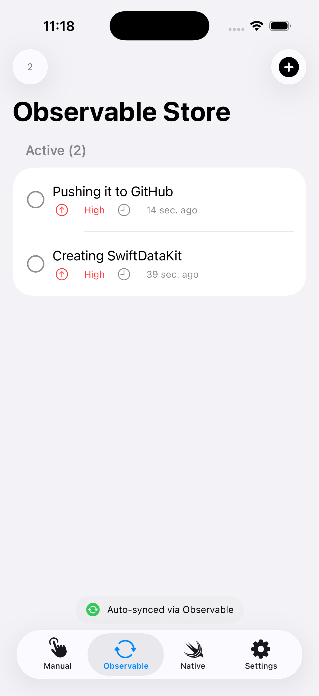
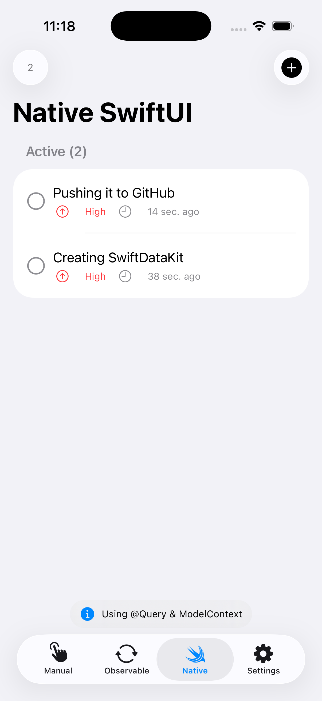

# SwiftDataKit

A lightweight, type-safe wrapper around SwiftData that simplifies database operations and provides flexible data management patterns for iOS, macOS, watchOS, and tvOS applications.

SwiftDataKit makes it easy to access and manage SwiftData outside of SwiftUI views - in ViewModels, services, business logic, and background tasks - while maintaining full compatibility with native SwiftUI patterns like `@Query` and `@Environment(\.modelContext)`.

## Overview

SwiftDataKit eliminates boilerplate code when working with SwiftData by providing:

- **Universal Access**: Use SwiftData anywhere in your app, not just in SwiftUI views
- **Centralized Configuration**: Single setup point for your entire data stack
- **Type-Safe Repository Pattern**: Generic data stores that work with any `PersistentModel`
- **Observable Data Stores**: Automatic UI synchronization with reactive updates
- **Flexible Querying**: Advanced filtering, sorting, pagination, and relationship prefetching
- **Background Context Support**: Easy concurrent operations without blocking the main thread
- **SwiftUI Compatible**: Works seamlessly alongside native SwiftUI data features

## Why SwiftDataKit?

SwiftData is powerful but tightly coupled to SwiftUI's view lifecycle with `@Query` and environment objects. This makes it challenging to use in ViewModels, services, or business logic layers. SwiftDataKit solves this by:

1. **Breaking Free from SwiftUI Views**: Access your data from ViewModels, repositories, services, and any other non-UI code
2. **Reducing Boilerplate**: No need to repeatedly configure `ModelContainer` and `ModelContext`
3. **Type Safety**: Compile-time guarantees for your data operations
4. **Flexibility**: Choose between manual control or reactive patterns based on your needs
5. **Native SwiftUI Support**: Still works perfectly with `@Query`, `@Environment`, and SwiftUI's native patterns
6. **Performance**: Built-in support for selective property fetching and relationship prefetching
7. **Testability**: Easy to mock with protocol-based architecture

## Screenshots

|              Manual Store              |             Observable Store             |            Native SwiftUI            |
| :------------------------------------: | :--------------------------------------: | :----------------------------------: |
|    |      |  |
| Manual data fetching with full control | Automatic UI updates with reactive store |      Native @Query integration       |

> **💡 Try it yourself!** Check out the [Example](Example/) project to see all three implementation patterns in action.

## Installation

### Swift Package Manager

Add SwiftDataKit to your project through Xcode:

1. File > Add Package Dependencies
2. Enter package URL: `https://github.com/cs4alhaider/SwiftDataKit`
3. Select version and add to your target

Or add it to your `Package.swift`:

```swift
dependencies: [
    .package(url: "https://github.com/cs4alhaider/SwiftDataKit", from: "1.0.0")
]
```

## Architecture

SwiftDataKit is built on a protocol-based architecture that provides flexibility and testability. Understanding the architecture helps you choose the right tool for your use case.

### Core Components

#### SwiftDataKit (Singleton)

The main singleton that manages `ModelContainer` and `ModelContext` for your entire application.

**Responsibilities:**

- Centralized configuration of the SwiftData stack
- Providing access to the main `ModelContext`
- Creating background contexts for concurrent operations
- Ensuring thread-safe database access

**Usage:**

```swift
// One-time configuration at app startup
try SwiftDataKit.configure(
    for: Todo.self, User.self, Project.self,
    config: ModelConfiguration(isStoredInMemoryOnly: false)
)

// Access anywhere in your app
let context = SwiftDataKit.shared.modelContext
let container = SwiftDataKit.shared.modelContainer

// Create background context for heavy operations
let backgroundContext = SwiftDataKit.shared.newBackgroundContext()
```

### Protocol Layer

#### DataRepository Protocol

Defines the standard CRUD operations that all data stores must implement. This protocol ensures type safety and provides a consistent interface for data operations.

```swift
protocol DataRepository<Model> {
    associatedtype Model: PersistentModel

    func create(_ item: Model) throws
    func fetch(
        sortedBy: [SortDescriptor<Model>],
        predicate: Predicate<Model>?,
        propertiesToFetch: PropertiesOption<Model>,
        relationshipKeyPathsForPrefetching: [PartialKeyPath<Model>]?,
        fetchOptions: FetchOptions
    ) throws -> [Model]
    func fetch(id: PersistentIdentifier) throws -> Model?
    func fetchCount(predicate: Predicate<Model>?) throws -> Int
    func update(_ item: Model, updates: (Model) -> Void) throws
    func delete(_ item: Model) throws
    func deleteAll(where predicate: Predicate<Model>?) throws
}
```

**Benefits:**

- Type-safe operations with generic constraints
- Testable through protocol conformance
- Consistent API across different implementations
- Easy to mock for unit testing

#### ObservableDataRepository Protocol

Extends `DataRepository` with observable capabilities for reactive UI updates.

```swift
protocol ObservableDataRepository: DataRepository, Observable {
    var items: [Model] { get set }
}
```

**Benefits:**

- Automatic UI updates when data changes
- Combines repository pattern with reactive programming
- Built-in synchronization with SwiftData changes

### Store Implementations

SwiftDataKit provides two concrete implementations of the repository protocols, each serving different use cases.

#### DataRepositoryStore

A **manual** data store for explicit control over data fetching and state management.

**When to use:**

- You want full control over when data is fetched
- You're building custom state management solutions
- You need to fetch data on-demand
- You're working with background contexts
- You prefer explicit data updates

**Characteristics:**

- No automatic data synchronization
- Lightweight with minimal overhead
- Full control over fetch timing
- Ideal for one-off queries or background operations

**Example:**

```swift
let todoStore = DataRepositoryStore<Todo>()

// Explicit fetch - you control when data is loaded
let todos = try todoStore.fetch(
    sortedBy: [SortDescriptor(\.createdAt, order: .reverse)],
    predicate: #Predicate { !$0.isCompleted }
)

// Manual state management
@State private var todos: [Todo] = []

func loadData() {
    todos = try? todoStore.fetch()
}
```

#### ObservableDataRepositoryStore

A **reactive** data store that automatically synchronizes with database changes.

**When to use:**

- You want automatic UI updates
- You're using SwiftUI with `@StateObject` or `@ObservedObject`
- You need real-time data synchronization
- You prefer declarative programming
- Your view should always show current data

**Characteristics:**

- Automatic data synchronization via `ModelContext.didSave` notifications
- Observable with `@Published` items property
- Configured with `FetchConfigrations` for consistent behavior
- Ideal for list views and real-time dashboards

**Example:**

```swift
@StateObject private var viewModel = TodoViewModel()

class TodoViewModel: ObservableObject {
    let store = ObservableDataRepositoryStore<Todo>(
        fetchConfiguration: FetchConfigrations(
            sortDescriptors: [SortDescriptor(\.createdAt, order: .reverse)],
            predicate: #Predicate { !$0.isCompleted },
            propertiesToFetch: .all,
            relationshipKeyPathsForPrefetching: nil,
            fetchOptions: .all
        )
    )

    // Items automatically update when database changes
    var todos: [Todo] {
        store.items
    }
}
```

### Choosing the Right Store

| Feature           | DataRepositoryStore          | ObservableDataRepositoryStore |
| ----------------- | ---------------------------- | ----------------------------- |
| Automatic Updates | No                           | Yes                           |
| Best For          | Custom logic, background ops | Real-time UI, lists           |
| Use Case          | On-demand fetching           | Always-current data           |

### Supporting Types

#### PropertiesOption

Controls which properties are fetched for performance optimization:

```swift
enum PropertiesOption<Model: PersistentModel> {
    case all                                    // Fetch all properties (default)
    case custom([PartialKeyPath<Model>])        // Fetch specific properties only
}
```

#### FetchOptions

Controls pagination and result set size:

```swift
enum FetchOptions {
    case all                                    // Fetch all matching items
    case paging(offset: Int, limit: Int)        // Paginated results
}
```

#### FetchConfigrations

Encapsulates all fetch parameters for `ObservableDataRepositoryStore`:

```swift
struct FetchConfigrations<Model: PersistentModel> {
    let sortDescriptors: [SortDescriptor<Model>]
    let predicate: Predicate<Model>?
    let propertiesToFetch: PropertiesOption<Model>
    let relationshipKeyPathsForPrefetching: [PartialKeyPath<Model>]?
    let fetchOptions: FetchOptions
}
```

## Quick Start

### 1. Define SwiftData Your Model

```swift
import SwiftData

@Model
final class Todo {
    var title: String
    var isCompleted: Bool
    var priority: Int
    var createdAt: Date

    init(title: String, isCompleted: Bool = false, priority: Int = 0) {
        self.title = title
        self.isCompleted = isCompleted
        self.priority = priority
        self.createdAt = Date()
    }
}
```

### 2. Configure SwiftDataKit

Configure once at app startup:

```swift
import SwiftUI
import SwiftDataKit

@main
struct MyApp: App {
    init() {
        do {
            try SwiftDataKit.configure(for: Todo.self)
        } catch {
            fatalError("Failed to configure database: \(error)")
        }
    }

    var body: some Scene {
        WindowGroup {
            ContentView()
                .modelContainer(SwiftDataKit.shared.modelContainer) // <-- If you want to access your data from SwiftUI, see Example project
        }
    }
}
```

### 3. Use DataRepositoryStore

```swift
import SwiftUI
import SwiftDataKit

struct ContentView: View {
    private let todoStore = DataRepositoryStore<Todo>()
    @State private var todos: [Todo] = []

    var body: some View {
        List(todos) { todo in
            Text(todo.title)
        }
        .onAppear {
            loadTodos()
        }
    }

    func loadTodos() {
        do {
            todos = try todoStore.fetch(
                sortedBy: [SortDescriptor(\.createdAt, order: .reverse)]
            )
        } catch {
            print("Failed to fetch todos: \(error)")
        }
    }
}
```

**Note:** You can also use native SwiftUI patterns like `@Query` alongside SwiftDataKit. The `.modelContainer()` modifier ensures both approaches work together:

```swift
struct ContentView: View {
    // Native SwiftUI approach
    @Query(sort: \.createdAt, order: .reverse) var todos: [Todo]

    // SwiftDataKit approach in ViewModel
    @StateObject private var viewModel = TodoViewModel()

    var body: some View {
        List {
            // Both work seamlessly together
            ForEach(todos) { todo in
                TodoRow(todo: todo)
            }
        }
    }
}
```

## Basic Operations

Now that you understand the architecture, let's see how to perform common data operations with both store types.

### CRUD with DataRepositoryStore

Manual control over all operations:

```swift
let todoStore = DataRepositoryStore<Todo>()

// CREATE: Add new items
let todo = Todo(title: "Buy groceries", priority: .high)
try todoStore.create(todo)

// READ: Fetch all items
let allTodos = try todoStore.fetch()

// READ: Fetch with sorting
let sortedTodos = try todoStore.fetch(
    sortedBy: [SortDescriptor(\.createdAt, order: .reverse)]
)

// READ: Fetch with filtering
let highPriorityTodos = try todoStore.fetch(
    predicate: #Predicate { $0.priority == .high }
)

// READ: Fetch by ID
if let todo = try todoStore.fetch(id: todoID) {
    print("Found: \(todo.title)")
}

// UPDATE: Modify existing items
try todoStore.update(todo) { item in
    item.title = "Buy groceries and cook dinner"
    item.isCompleted = true
}

// DELETE: Remove single item
try todoStore.delete(todo)

// DELETE: Remove multiple items
try todoStore.deleteAll(where: #Predicate { $0.isCompleted })

// DELETE: Remove all items
try todoStore.deleteAll()

// COUNT: Get item count
let totalCount = try todoStore.fetchCount()
let completedCount = try todoStore.fetchCount(
    predicate: #Predicate { $0.isCompleted }
)
```

### CRUD with ObservableDataRepositoryStore

Automatic synchronization with reactive updates:

```swift
class TodoViewModel: ObservableObject {
    let store = ObservableDataRepositoryStore<Todo>(
        fetchConfiguration: FetchConfigrations(
            sortDescriptors: [SortDescriptor(\.createdAt, order: .reverse)],
            predicate: nil,  // Fetch all
            propertiesToFetch: .all,
            relationshipKeyPathsForPrefetching: nil,
            fetchOptions: .all
        )
    )

    // Items are automatically updated
    var todos: [Todo] { store.items }

    // CREATE
    func addTodo(title: String) {
        let todo = Todo(title: title)
        try? store.create(todo)
    }

    // UPDATE
    func toggleCompletion(_ todo: Todo) {
        try? store.update(todo) { $0.isCompleted.toggle() }
    }

    func setPriority(_ todo: Todo, priority: Priority) {
        try? store.update(todo) { $0.priority = priority }
    }

    // DELETE
    func deleteTodo(_ todo: Todo) {
        try? store.delete(todo)
    }

    func clearCompleted() {
        try? store.deleteAll(where: #Predicate { $0.isCompleted })
    }

    // COUNT (manual fetch, not auto-updated)
    func getCompletedCount() -> Int {
        (try? store.fetchCount(predicate: #Predicate { $0.isCompleted })) ?? 0
    }
}

// Usage in SwiftUI
struct TodoListView: View {
    @StateObject private var viewModel = TodoViewModel()

    var body: some View {
        List(viewModel.todos) { todo in
            TodoRow(todo: todo)
        }
    }
}
```

## Advanced Features

Beyond basic CRUD operations, SwiftDataKit offers powerful features for optimizing performance and handling complex scenarios.

### Selective Property Fetching

Fetch only the properties you need to reduce memory usage and improve performance. This is especially useful for large models or when displaying preview data.

```swift
// Example: Fetch only titles and IDs for a list preview
let todoStore = DataRepositoryStore<Todo>()

let previews = try todoStore.fetch(
    propertiesToFetch: .custom([\Todo.id, \Todo.title, \Todo.isCompleted])
)

// The fetched objects will only have these properties loaded
// Other properties remain as faults until accessed
```

**Use cases:**

- List views that only show partial data
- Search results with minimal details
- Performance-critical sections
- Reducing memory footprint

### Relationship Prefetching

Avoid N+1 query problems by loading relationships upfront. Without prefetching, accessing each relationship triggers a separate database query.

```swift
@Model
class Project {
    var name: String
    var tasks: [Task]
    var owner: User
    // ...
}

let projectStore = DataRepositoryStore<Project>()

// Prefetch relationships to avoid N+1 queries
let projects = try projectStore.fetch(
    relationshipKeyPathsForPrefetching: [\Project.tasks, \Project.owner]
)

// Now accessing tasks and owner won't trigger additional queries
for project in projects {
    print("\(project.name) has \(project.tasks.count) tasks")  // No additional query
    print("Owner: \(project.owner.name)")  // No additional query
}
```

**Performance impact:**

- Without prefetching: 1 + N queries (one for projects, one for each relationship access)
- With prefetching: 1 query with joins

### Pagination

Handle large datasets efficiently by loading data in chunks. Essential for maintaining performance with thousands of records.

```swift
let todoStore = DataRepositoryStore<Todo>()
let pageSize = 20

// Load first page
let page1 = try todoStore.fetch(
    sortedBy: [SortDescriptor(\.createdAt, order: .reverse)],
    fetchOptions: .paging(offset: 0, limit: pageSize)
)

// Load second page
let page2 = try todoStore.fetch(
    sortedBy: [SortDescriptor(\.createdAt, order: .reverse)],
    fetchOptions: .paging(offset: pageSize, limit: pageSize)
)

// Generic pagination function
func fetchPage<T: PersistentModel>(
    _ store: DataRepositoryStore<T>,
    page: Int,
    pageSize: Int
) throws -> [T] {
    try store.fetch(
        fetchOptions: .paging(offset: page * pageSize, limit: pageSize)
    )
}
```

### Complex Predicates

Build sophisticated filters using Swift's `#Predicate` macro:

```swift
let todoStore = DataRepositoryStore<Todo>()

// Multiple conditions
let urgentTodos = try todoStore.fetch(
    predicate: #Predicate { todo in
        !todo.isCompleted &&
        todo.priority >= .high &&
        todo.createdAt > Date.now.addingTimeInterval(-86400)
    }
)

// String operations
let searchResults = try todoStore.fetch(
    predicate: #Predicate { todo in
        todo.title.localizedStandardContains(searchTerm)
    }
)

// Date comparisons
let thisWeek = try todoStore.fetch(
    predicate: #Predicate { todo in
        todo.createdAt > Date.now.addingTimeInterval(-7 * 86400)
    }
)

// Combining multiple predicates
let criticalPredicate = #Predicate<Todo> { todo in
    todo.priority == .high &&
    !todo.isCompleted &&
    todo.dueDate < Date.now
}
let critical = try todoStore.fetch(predicate: criticalPredicate)
```

### Background Operations

Perform intensive operations without blocking the UI thread. Each background context has its own change tracking.

```swift
// Heavy import operation
Task.detached {
    let backgroundContext = SwiftDataKit.shared.newBackgroundContext()
    let backgroundStore = DataRepositoryStore<Todo>(modelContext: backgroundContext)

    // Import thousands of items
    for i in 0..<10000 {
        let todo = Todo(title: "Imported Task \(i)")
        try backgroundStore.create(todo)
    }
}

// Background processing with progress
func importTodos(from items: [ImportItem]) async throws {
    let backgroundContext = SwiftDataKit.shared.newBackgroundContext()
    let backgroundStore = DataRepositoryStore<Todo>(modelContext: backgroundContext)

    for (index, item) in items.enumerated() {
        let todo = Todo(title: item.title, priority: item.priority)
        try backgroundStore.create(todo)

        if index % 100 == 0 {
            await MainActor.run {
                updateProgress(current: index, total: items.count)
            }
        }
    }
}
```

### Combining Features

Most powerful when combining multiple features:

```swift
// High-performance paginated query with selective fetching
let optimizedFetch = try todoStore.fetch(
    sortedBy: [
        SortDescriptor(\.priority, order: .forward),
        SortDescriptor(\.createdAt, order: .reverse)
    ],
    predicate: #Predicate { !$0.isCompleted },
    propertiesToFetch: .custom([\Todo.title, \Todo.priority]),
    relationshipKeyPathsForPrefetching: [\Todo.category],
    fetchOptions: .paging(offset: 0, limit: 50)
)
```

## Migration Support

SwiftDataKit supports schema migrations:

```swift
enum AppMigrationPlan: SchemaMigrationPlan {
    static var schemas: [any VersionedSchema.Type] {
        [TodoSchemaV1.self, TodoSchemaV2.self]
    }

    static var stages: [MigrationStage] {
        [migrateV1toV2]
    }

    static let migrateV1toV2 = MigrationStage.custom(
        fromVersion: TodoSchemaV1.self,
        toVersion: TodoSchemaV2.self,
        willMigrate: nil,
        didMigrate: nil
    )
}

// Configure with migration plan
try SwiftDataKit.configure(
    for: Todo.self,
    migrationPlan: AppMigrationPlan.self
)
```

## Testing

SwiftDataKit makes testing easy with in-memory configurations:

```swift
class TodoServiceTests: XCTestCase {
    var testStore: DataRepositoryStore<Todo>!

    override func setUp() {
        super.setUp()

        // Configure with in-memory storage
        try! SwiftDataKit.configure(
            for: Todo.self,
            config: ModelConfiguration(isStoredInMemoryOnly: true)
        )

        testStore = DataRepositoryStore<Todo>()
    }

    override func tearDown() {
        SwiftDataKit.shared.reset()
        super.tearDown()
    }

    func testCreateTodo() throws {
        let todo = Todo(title: "Test Todo")
        try testStore.create(todo)

        let todos = try testStore.fetch()
        XCTAssertEqual(todos.count, 1)
        XCTAssertEqual(todos.first?.title, "Test Todo")
    }
}
```

## Architecture Patterns

### Repository Pattern

```swift
protocol TodoRepository {
    func getAllTodos() async throws -> [Todo]
    func getIncompleteTodos() async throws -> [Todo]
    func createTodo(title: String) async throws
    func completeTodo(_ todo: Todo) async throws
}

class TodoRepositoryImpl: TodoRepository {
    private let store = DataRepositoryStore<Todo>()

    func getAllTodos() async throws -> [Todo] {
        try store.fetch(
            sortedBy: [SortDescriptor(\.createdAt, order: .reverse)]
        )
    }

    func getIncompleteTodos() async throws -> [Todo] {
        try store.fetch(
            predicate: #Predicate { !$0.isCompleted }
        )
    }

    func createTodo(title: String) async throws {
        let todo = Todo(title: title)
        try store.create(todo)
    }

    func completeTodo(_ todo: Todo) async throws {
        try store.update(todo) { $0.isCompleted = true }
    }
}
```

### MVVM Pattern

```swift
@MainActor
class TodoListViewModel: ObservableObject {
    private let store = ObservableDataRepositoryStore<Todo>(
        fetchConfiguration: .default
    )

    var todos: [Todo] {
        store.items
    }

    func addTodo(title: String) {
        let todo = Todo(title: title)
        try? store.create(todo)
    }

    func toggleCompletion(for todo: Todo) {
        try? store.update(todo) { $0.isCompleted.toggle() }
    }

    func deleteTodo(_ todo: Todo) {
        try? store.delete(todo)
    }

    func clearCompleted() {
        try? store.deleteAll(where: #Predicate { $0.isCompleted })
    }
}
```

## Configuration Options

### ModelConfiguration

```swift
// Persistent storage (default)
try SwiftDataKit.configure(
    for: Todo.self,
    config: ModelConfiguration(
        isStoredInMemoryOnly: false,
        allowsSave: true
    )
)

// In-memory storage (for testing or temporary data)
try SwiftDataKit.configure(
    for: Todo.self,
    config: ModelConfiguration(isStoredInMemoryOnly: true)
)

// Custom storage location
let url = FileManager.default.urls(for: .documentDirectory, in: .userDomainMask).first!
try SwiftDataKit.configure(
    for: Todo.self,
    config: ModelConfiguration(url: url.appendingPathComponent("MyApp.sqlite"))
)
```

### Fetch Configuration

```swift
let config = FetchConfigrations<Todo>(
    sortDescriptors: [
        SortDescriptor(\.priority, order: .forward),
        SortDescriptor(\.createdAt, order: .reverse)
    ],
    predicate: #Predicate { !$0.isCompleted },
    propertiesToFetch: .all,
    relationshipKeyPathsForPrefetching: [\Todo.category],
    fetchOptions: .paging(offset: 0, limit: 50)
)

let store = ObservableDataRepositoryStore<Todo>(fetchConfiguration: config)
```

## Performance Tips

1. **Use Selective Property Fetching**: Only fetch properties you need for better performance
2. **Prefetch Relationships**: Avoid N+1 queries by prefetching related objects
3. **Implement Pagination**: For large datasets, use pagination instead of fetching all items
4. **Use Background Contexts**: Move heavy operations to background threads
5. **Batch Operations**: Use `deleteAll(where:)` instead of deleting items one by one
6. **Enable Autosave**: SwiftDataKit enables autosave by default for convenience

## Requirements

- iOS 17.0+ / macOS 14.0+ / watchOS 10.0+ / tvOS 17.0+
- Swift 5.9+
- Xcode 15.0+

## License

MIT License - see LICENSE file for details

## Contributing

Contributions are welcome! Please feel free to submit a Pull Request.

## Author

Abdullah Alhaider

## Acknowledgments

Built on top of Apple's SwiftData framework, providing a more convenient and flexible API for common use cases.
